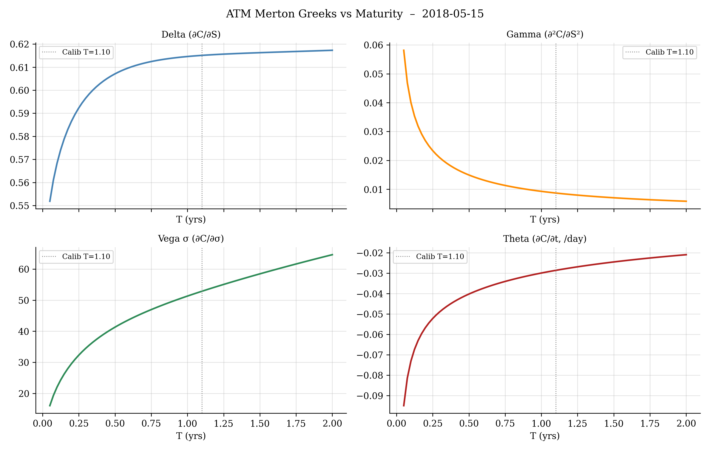
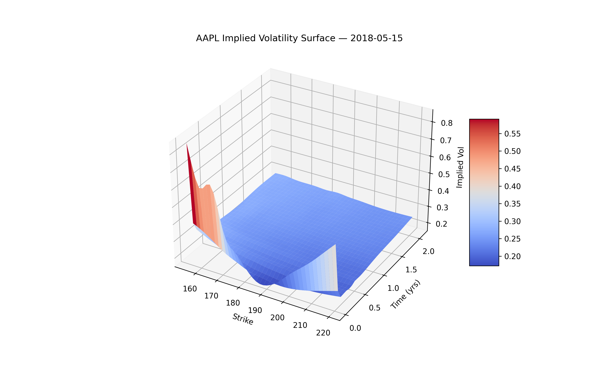
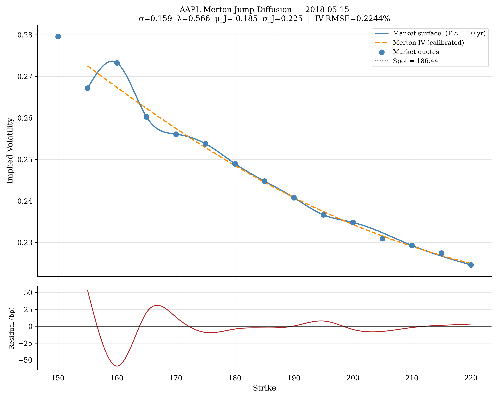

# AAPL Options Pricing Models

Implements and compares Black-Scholes, Heston, and Merton Jump-Diffusion models on real AAPL equity options data (2016–2020). The pipeline covers data ingestion, date-driven rate calibration, implied vol surface construction, multi-expiry calibration, analytical Greeks, and publication-quality visualisations.

---

## Models

### Black-Scholes (1973)

Under the risk-neutral measure, the stock follows:

$$dS_t = r \, S_t \, dt + \sigma \, S_t \, dW_t$$

The call price is:

$$C = S \cdot N(d_1) - K e^{-rT} \cdot N(d_2), \quad d_1 = \frac{\ln(S/K) + (r + \frac{1}{2}\sigma^2)T}{\sigma\sqrt{T}}, \quad d_2 = d_1 - \sigma\sqrt{T}$$

Implemented without dividends, consistent with the original formulation. A flat vol σ is calibrated per-expiry by minimising vega-weighted relative price error via `scipy.optimize.minimize_scalar` (bounded Brent). The vol surface is built with QuantLib's `BlackVarianceSurface` and bicubic interpolation.

**Limitation:** a single flat σ cannot reproduce the volatility smile. Average absolute error on the 1-year expiry: ~4.0%. Overall vega-weighted error across 17 expiries: 16.5%.

---

### Heston Stochastic Volatility (1993)

Variance evolves as a mean-reverting CIR process correlated with the spot:

$$dS_t = (r - q) S_t \, dt + \sqrt{v_t} \, S_t \, dW_t^S$$

$$dv_t = \kappa(\theta - v_t) \, dt + \sigma_v \sqrt{v_t} \, dW_t^v, \quad \mathbb{E}[dW_t^S \, dW_t^v] = \rho \, dt$$

| Parameter | Meaning |
|---|---|
| $v_0$ | Initial instantaneous variance |
| $\kappa$ | Mean-reversion speed |
| $\theta$ | Long-run variance |
| $\sigma_v$ | Vol-of-vol |
| $\rho$ | Spot-vol correlation (negative = leverage effect) |

The Feller condition $2\kappa\theta > \sigma_v^2$ ensures variance stays positive. In practice, calibration often violates it - the optimiser pushes toward high vol-of-vol, a known pathology handled by the CIR reflection boundary.

Priced via QuantLib's `AnalyticHestonEngine` (Fourier inversion), calibrated with `LevenbergMarquardt` against market call prices. Dividend yield included via the Merton (1973) continuous-dividend extension.

**Calibrated parameters (2018-05-15):** v₀ = 0.1704, κ = 9.54, θ = 0.0694, σᵥ = 3.36, ρ = −0.463. Average absolute error: 1.52%.

---

### Merton Jump-Diffusion (1976)

Augments BS diffusion with a compound Poisson jump process:

$$dS_t = (r - q - \lambda \bar{\kappa}) S_t \, dt + \sigma S_t \, dW_t + (J-1) S_t \, dN_t$$

where $N_t$ is a Poisson process with intensity $\lambda$, and $J = e^Y$, $Y \sim \mathcal{N}(\mu_J, \sigma_J^2)$ is a lognormal jump size. The closed-form pricing series is:

$$C^{\text{Merton}} = \sum_{n=0}^{\infty} \frac{e^{-\lambda' T}(\lambda' T)^n}{n!} \cdot C^{\text{BS}}\!\left(S, K, r_n, q, T, \sigma_n\right)$$

$$r_n = r - \lambda\bar{\kappa} + \frac{n(\mu_J + \frac{1}{2}\sigma_J^2)}{T}, \quad \sigma_n = \sqrt{\sigma^2 + \frac{n \sigma_J^2}{T}}, \quad \bar{\kappa} = e^{\mu_J + \frac{1}{2}\sigma_J^2} - 1$$

Truncated at 50 terms (early exit when weights drop below `1e-12`). Calibrated via multi-start L-BFGS-B (5 random seeds, objective = IV-RMSE).

**Calibrated parameters (2018-05-15):** σ = 15.9%, λ = 0.57 jumps/yr, μ_J = −18.5%, σ_J = 22.6%. This implies roughly one crash-sized jump per year averaging a −14.7% return - economically consistent with AAPL tail risk pricing over 2018. IV-RMSE = 0.22%.

---

## Greeks - Merton Jump-Diffusion

Greeks are derived analytically by differentiating the infinite series term-by-term, applying the chain rule for the per-term vol:

$$\frac{\partial \sigma_n}{\partial \sigma} = \frac{\sigma}{\sigma_n}, \qquad \frac{\partial \sigma_n}{\partial \sigma_J} = \frac{n \sigma_J / T}{\sigma_n}$$

ATM Greeks at S = K = 186.44, T = 1.101 yr (2018-05-15):

| Greek | Value | Interpretation |
|---|---|---|
| Price | $19.51 | ATM call value |
| Delta Δ | 0.6151 | $0.615 gain per $1 spot move |
| Gamma Γ | 0.00867 | Delta change per $1 spot move |
| Vega σ | 52.88 | $52.88 per unit diffusion vol increase |
| Vega σ_J | 26.90 | $26.90 per unit jump vol increase |
| Theta Θ | −0.02864 | ~$0.029 loss per calendar day |
| Rho ρ | 1.0481 | $1.05 per 1 bp rise in r |



---

## Volatility Surface & Results

The market vol surface is built from QuantLib `BlackVarianceSurface` with bicubic interpolation across 17 expiries, showing a pronounced left-wing skew and upward-sloping term structure (~18% short-dated to ~26% at 2 years).

| Metric | Black-Scholes | Heston | Merton JDM |
|---|---|---|---|
| Parameters | 1 per expiry | 5 | 4 |
| Avg price error (1yr) | 3.97% | 1.52% | 0.34% |
| IV-RMSE (1yr) | ~400 bp | ~150 bp | 14 bp |
| Smile shape | Flat | Monotone skew | Flexible skew + curvature |
| Greeks | Analytical | Numerical / QL | Analytical (series) |




---

## Market Data & Rate Calibration

**Data:** AAPL options chain (CBOE-style CSV) from [Kaggle](https://www.kaggle.com/kylegraupe/aapl-options-data-2016-to-2020) by Kyle Graupe, 2016-01-04 to 2020-12-31. Strike filter: ±20% moneyness band around spot.

Risk-free rates from FRED H.15 (1-year Treasury CMT) and AAPL dividend yields are linearly interpolated by fractional year - no fixed arbitrary rate. Black-Scholes is implemented without dividends per its original formulation; Heston and Merton include continuous dividend yield.

---

## Installation & Usage

Python 3.9+ required. QuantLib can be tricky on Windows - use conda if pip fails.

```bash
pip install -r requirements.txt
# or
conda install -c conda-forge quantlib-python numpy pandas scipy matplotlib
```

Each script prompts for a quote date at runtime:

```bash
python models/BlackScholesOPM.py        # calibration table + 4 graphs
python models/HestonOPM.py              # Heston params + Feller check + 3 graphs
python models/MertonJumpDiffusionOPM.py # multi-start calibration + Greeks + 4 graphs
```

Interesting dates: `2020-03-16` (COVID crash), `2019-01-03` (AAPL profit warning), `2016-06-24` (Brexit vol spike).

---

## References

- Black & Scholes (1973). *The Pricing of Options and Corporate Liabilities.* Journal of Political Economy.
- Heston (1993). *A Closed-Form Solution for Options with Stochastic Volatility.* Review of Financial Studies.
- Merton (1976). *Option Prices When Underlying Stock Returns Are Discontinuous.* Journal of Financial Economics.
- Gatheral (2006). *The Volatility Surface: A Practitioner's Guide.* Wiley Finance.
- Cont & Tankov (2004). *Financial Modelling with Jump Processes.* Chapman & Hall.
- [QuantLib](https://www.quantlib.org/) · [FRED H.15](https://www.federalreserve.gov/releases/h15/)

---

*Python 3.12 · QuantLib · NumPy · SciPy · Matplotlib · MIT License*
